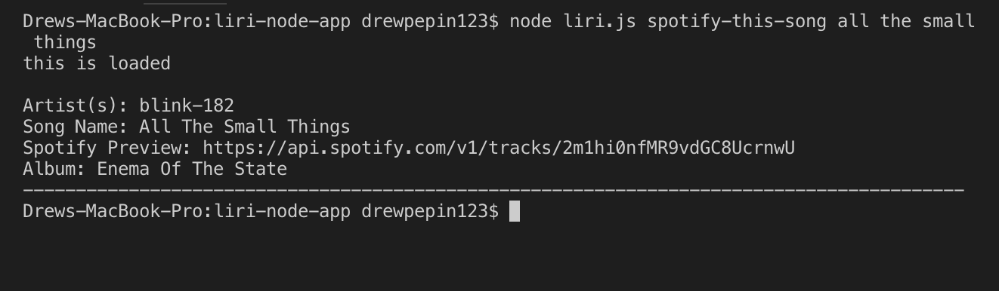

# liri-node-app

## Creator: Drew Pepin
## Created On: September 7th 2019

## Demo

## About the App
Liri takes in information from the command line that the user can change, and gives back data. The user has the option to utilize 4 commands. 
- concert-this
- spotify-this-song
- movie-this
- do-what-it-says

## How to use

1. Open your terminal 
2. Navigate to the folder that contains liri.js file

## Concert This Command

Enter "node liri.js concert-this < insert name of artist or band here >" into the command line in terminal.
The terminal will display a list of information about recent/upcoming concerts for that band or artist. 

## Spotify This Song Command

Enter "node liri.js spotify-this-song < name of any song >" into the command line in terminal.
The terminal will display info about the song. 

## Movie This Command

Enter "node liri.js movie-this < name of movie >" into the command line in the terminal.
The terminal will display information about the movie.

## Do What It Says Command

Enter "node liri.js do-what-it-says" into the terminal command line. The terminal will pull the input for the arguments from a seperate file, and data will be displayed for the concert, song, or movie, depending on what is written in the text file. 

## Technologies Used 
- javascript 
- Nodejs
- Node Packages
 - node-spotify-api
 - Axios
 - Moment
 - DotEnv
 - FS
- APIs
 - BandsInTown
 - OMDB
- GIT
- GitHub

